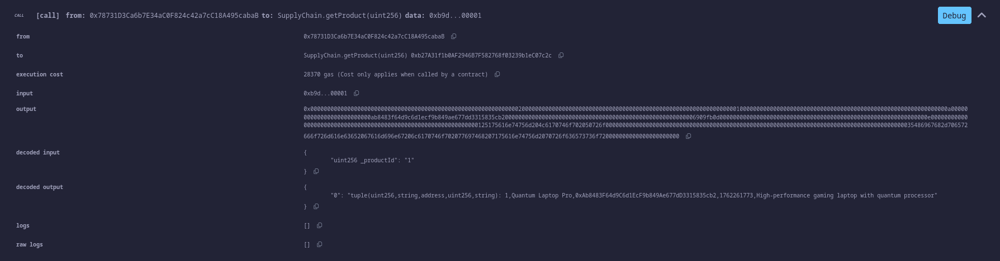
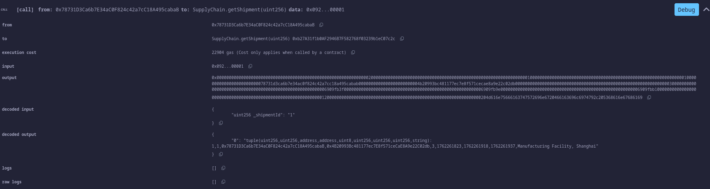
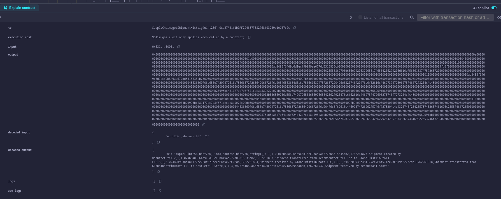
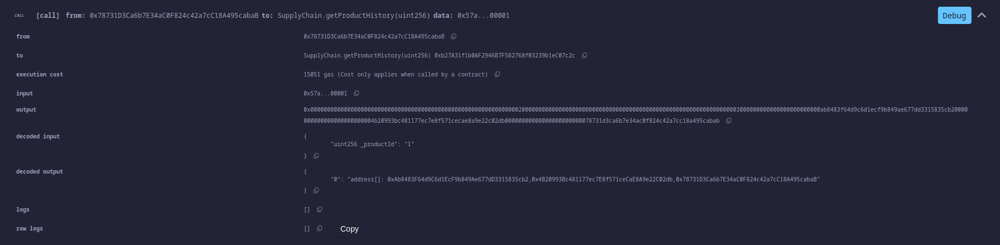
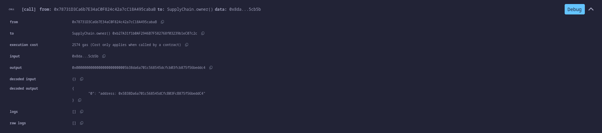

# 🏭 Supply Chain Management Smart Contract

## 📘 Overview of the Assignment

This project implements a **blockchain-based Supply Chain Management System** using **Solidity**.
The contract models real-world product tracking and shipment flow between **Manufacturers**, **Distributors**, and **Retailers**, ensuring **transparency, traceability, and accountability**.

### 🎯 Objectives

* Enable **role-based access control** among supply chain participants.
* Maintain an **immutable record** of product creation, shipment transfers, and receipt.
* Ensure **secure tracking** of ownership and shipment history on-chain.
* Demonstrate **event logging** for audit and traceability.

---

## ⚙️ System Components

| Component           | Description                                                         |
| ------------------- | ------------------------------------------------------------------- |
| **Participants**    | Entities in the supply chain (Manufacturer, Distributor, Retailer). |
| **Products**        | Items created by manufacturers with unique IDs and details.         |
| **Shipments**       | Track product movement and ownership between participants.          |
| **Shipment Events** | Record every action (creation, transfer, receive) for traceability. |

---

## 🚀 How to Set Up and Run the Contract (Remix / Ganache / Hardhat)

### 🧩 Prerequisites

* [Remix IDE](https://remix.ethereum.org) (online)
* or [Ganache](https://trufflesuite.com/ganache/) for local blockchain testing
* or [Hardhat](https://hardhat.org/) for a development environment
* MetaMask wallet (optional, for simulation)

### 🪜 Steps (Using Remix IDE)

1. **Open Remix** at [https://remix.ethereum.org](https://remix.ethereum.org)
2. **Create a new file** `SupplyChain.sol`
3. **Copy and paste** the full Solidity code from this repository.
4. **Compile** the contract:

   * Compiler version: `0.8.0` or above
   * Ensure “Enable optimization” is unchecked for simplicity.
5. **Deploy** the contract:

   * Select **Injected Provider - MetaMask** or **Remix VM (London)** as the environment.
   * Click **Deploy**.
6. **Interact** with the contract using the Remix UI:

   * Register participants using `registerParticipant()`
   * Create products using `createProduct()`
   * Create and transfer shipments using `createShipment()` and `transferShipment()`
   * Confirm delivery with `receiveShipment()`
   * View details with `getProduct()`, `getShipment()`, `getShipmentHistory()`

---

## 🧪 How to Simulate Transactions

### ✅ Step-by-Step Example

1. **Register Participants**

   ```solidity
   registerParticipant(0xABC..., 0, "ABC Manufacturing");   // Manufacturer
   registerParticipant(0xDEF..., 1, "XYZ Distribution");     // Distributor
   registerParticipant(0xGHI..., 2, "RetailOne");            // Retailer
   ```

2. **Create Product**

   ```solidity
   createProduct("Chocolate Bar", "Organic cocoa-based snack");
   ```

3. **Create Shipment**

   ```solidity
   createShipment(1, "Factory Warehouse");
   ```

4. **Transfer Shipment**

   * From **Manufacturer → Distributor**

     ```solidity
     transferShipment(1, 0xDEF...);
     ```
   * From **Distributor → Retailer**

     ```solidity
     transferShipment(1, 0xGHI...);
     ```

5. **Receive Shipment**

   * Executed by the current owner (Retailer)

     ```solidity
     receiveShipment(1);
     ```

6. **Query History**

   * View product details:

     ```solidity
     getProduct(1);
     ```
   * View shipment events:

     ```solidity
     getShipmentHistory(1);
     ```

---

## 🛡️ Security Threat Analysis and Mitigation Strategies

### 🔍 Threats Identified & Countermeasures

| Threat                               | Description                                                   | Mitigation                                                                                                    |
| ------------------------------------ | ------------------------------------------------------------- | ------------------------------------------------------------------------------------------------------------- |
| **Unauthorized Access**              | Unregistered users may try to access restricted functions.    | Enforced via `onlyRegistered`, `onlyManufacturer`, `onlyDistributor`, and `onlyRetailer` modifiers.           |
| **Ownership Spoofing**               | A user might attempt to transfer shipments they don’t own.    | Verified with `require(shipments[_id].currentOwner == msg.sender)` before transfer.                           |
| **Data Tampering**                   | Participants might attempt to alter product or shipment data. | Data stored on-chain is immutable once recorded; new states are logged as events.                             |
| **Role Misuse**                      | Participants acting beyond their supply chain role.           | Role-based logic ensures manufacturers can only transfer to distributors, and distributors only to retailers. |
| **Privacy Leakage**                  | Unauthorized users viewing product/shipment details.          | Access control in `getProduct()` and `getShipment()` restricts data visibility to involved parties.           |
| **Event Replay or Double Transfers** | Reusing transaction data to manipulate shipment status.       | Solidity’s state variables and `require` conditions prevent duplicate shipment actions.                       |

---

## 🧩 Smart Contract Design Highlights

* **Event-driven logging** for all actions (`ShipmentCreated`, `ShipmentTransferred`, etc.)
* **Mapping-based lookups** for O(1) access time.
* **Role-based security model**.
* **Transparent audit trail** through `shipmentHistory` and `productOwnershipHistory`.
* **Access control** ensures integrity and traceability of the supply chain.

---

## 📚 Suggested Improvements

* Integrate with **IPFS** for off-chain product metadata storage.
* Add **digital signatures** for proof of authenticity.
* Connect front-end via **Web3.js** or **Ethers.js** for UI-based interaction.
* Deploy to a **private Fabric or Ethereum test network** for real-time demos.

---







